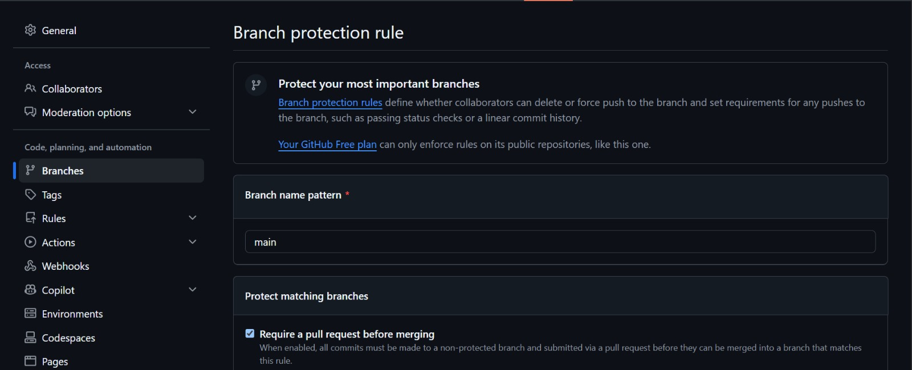
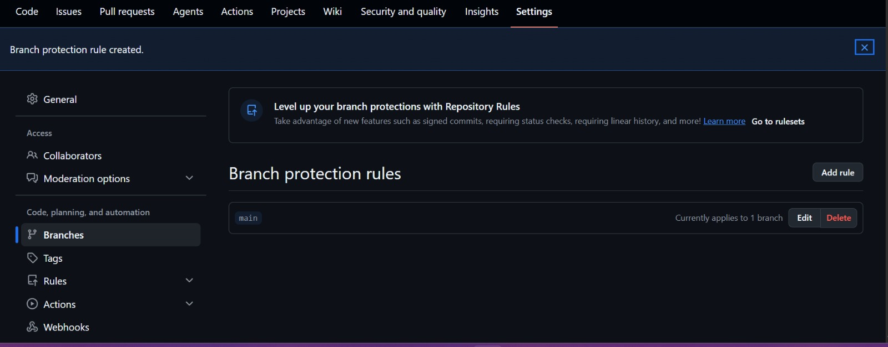

# data-engineering-toolkit

## Introduction
This project is a collection of data engineering tasks to demonstrate my understanding and practical use of Git. The project focuses on applying version control best practices, including Gitflow branching, feature development, pull requests, code reviews, and structured releases while building reusable data engineering scripts.

## Repository Creation
- Task 1: I started by creating a remote github repository initialized with a Readme File
- Task 2: Clone the repository to local Machine
    - I did this by running a `git clone https://github.com/beingEniola/data-engineering-toolkit.git`
- Task 3: Set up a .gitignore file to exclude unnecessary files 
    - I achieved this with `touch .gitignore` then I specified the files to ignore in the text editor
- Task 4: Write a Readme

## Set Up Branching Strategy
- Task 1: using Gitflow Model, I will have the following branches
    - Main branch for stable, production-ready code.
    - Develop branch for integration.
    - Feature branches (feature/branch-name) for new features or scripts.
- Task 2: Set up branch protection rules on GitHub for the main branch to require pull requests before merges.

    To create this I went under the settings tab, clicked on branches on the left side tab and selected "add classic branch protection rule"

    

    

## Develop Scripts on Feature Branches
- Task 1: Choose three features that each represent a data engineering task
    - Data Cleaning Script to Automate basic data cleansing functions.
    - Data Transformation Script to create functions to apply transformations to data frames.
    - Data Loading Script to create functions that write data to file.
- Task 2: 

