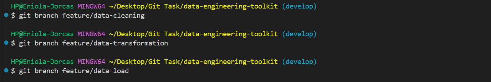
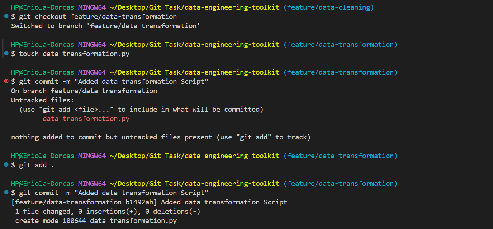
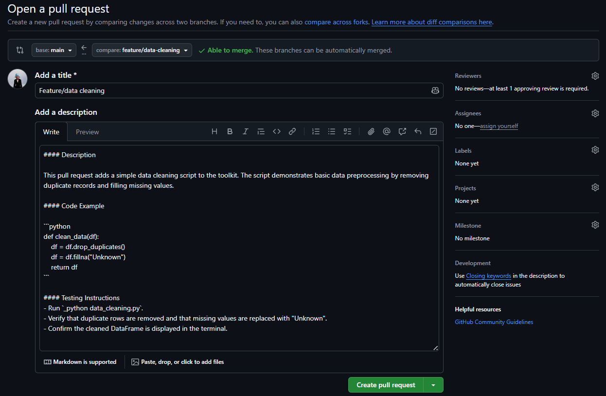
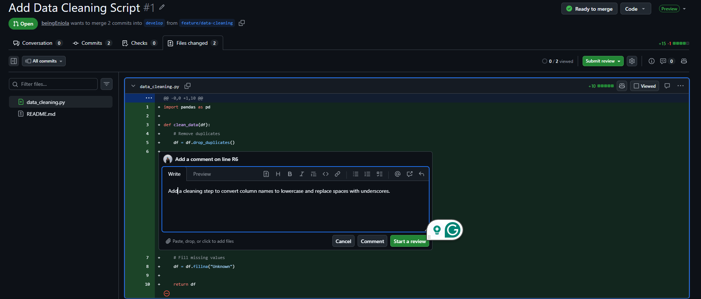
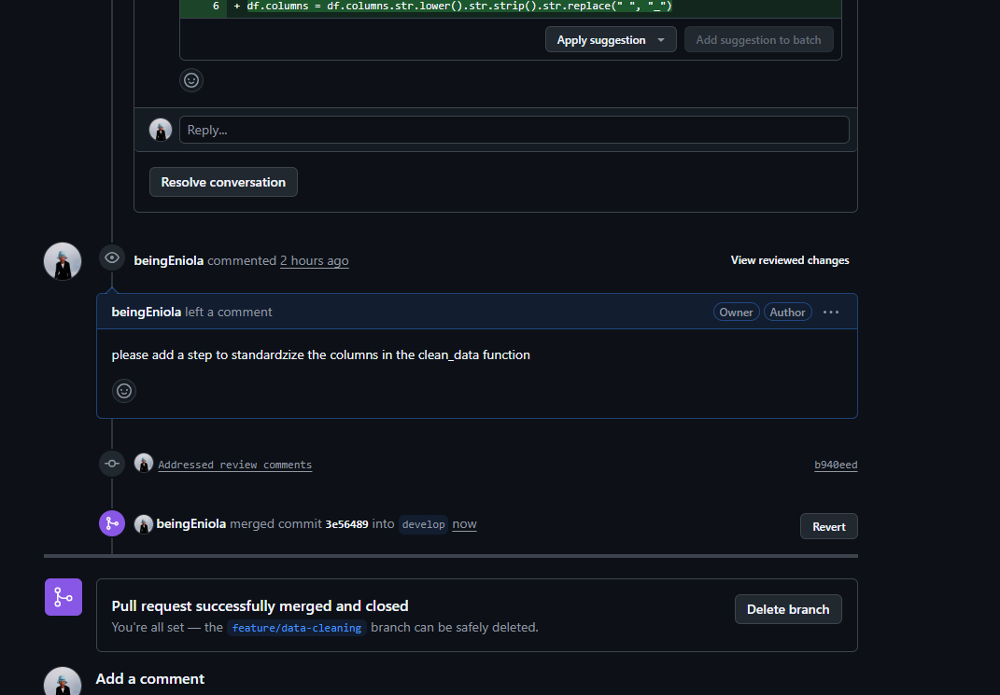
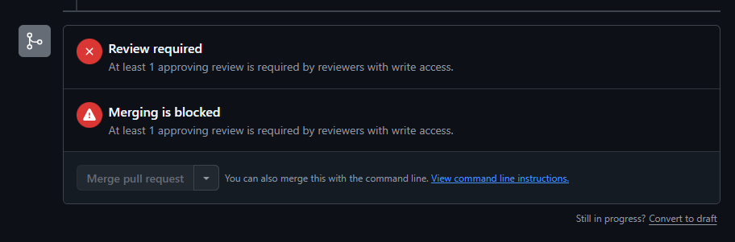
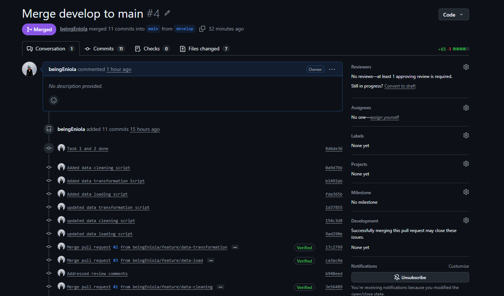

# data-engineering-toolkit

## Introduction
This project is a collection of data engineering tasks to demonstrate my understanding and practical use of Git. The project focuses on applying version control best practices, including Gitflow branching, feature development, pull requests, code reviews, and structured releases while building reusable data engineering scripts.

## Repository Creation
- Task 1: I started by creating a remote github repository initialized with a Readme File
- Task 2: Clone the repository to local Machine
    - I did this by running a `git clone https://github.com/beingEniola/data-engineering-toolkit.git`
- Task 3: Set up a .gitignore file to exclude unnecessary files 
    - I achieved this with `touch .gitignore` then I specified the files to ignore in the text editor
- Task 4: Write a Readme

## Set Up Branching Strategy
- Task 1: using Gitflow Model, I will have the following branches
    - Main branch for stable, production-ready code.
    - Develop branch for integration.
    - Feature branches (feature/branch-name) for new features or scripts.
- Task 2: Set up branch protection rules on GitHub for the main branch to require pull requests before merges.

    To create this I went under the settings tab, clicked on branches on the left side tab and selected "add classic branch protection rule"

    

    

## Develop Scripts on Feature Branches
- Task 1: Choose three features that each represent a data engineering task
    - Data Cleaning Script to Automate basic data cleansing functions.
    - Data Transformation Script to create functions to apply transformations to data frames.
    - Data Loading Script to create functions that write data to file.
- Task 2: Create separate feature branches for each toolkit script.
    - To create a data cleaning feature branch- `git branch feature/data-cleaning`
    - To create a data transformation feature branch-  `git branch feature/data-transformation`
    - To create a data load feature branch-  `git branch feature/data-load`

    

- Task 3: Develop each script on its respective branch, committing frequently.
    1. Switch to the feature branch first `git checkout feature/data-cleaning`
    2. On the feature branch, I created a file for the feature `touch data_cleaning.py`
    3. Added the file and commit it: `git add .` `git commit -m "Added data cleaning script"`
    4. Defined the function for data cleaning in data_cleaning.py file
    5. Added and commited the updated file `git commit -m "Updated data cleaning script"`

    

#### Pull Request and Code Review Process
- Task 1: Once a feature is ready, push the branch to GitHub.

I pushed the feature branch by `git push origin feature/data-cleaning`
- Task 2: Open a pull request (PR) from the feature branch to the develop branch

I opened a pull request, ensuring that it included a description, code sample, and testing instructions

    NB: I took the screenshot before changing the base branch to develop
- Task 3: Set up a code review

I set up a code review on feature/data-cleaning and added a comment to practice code review
    

- Task 4: Address any code review comments and iterate by pushing updates to the feature branch.

I addressed the code review, made amendments and pushed back to origin which automatically updated the pull request
- Task 5: Approved the pull request and merged to develop

    

#### Merging to Main and Releasing Versions
- Task:  Periodically merge the develop branch into main.

After successfully merging the feature branches to develop, I merged the develop branch to main.
While doing this I faced a challenge, I could not merge the develop to main because of the branch protection rule I set earlier that requires at least one approving review. To solve this I had two options, either remove the branch rule or add a collaborator with write access to approve the pull request.
    

I couldn't get a collaborator in a short time so I went for removing the rule, to hasten the submission of this project.

